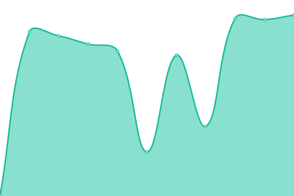
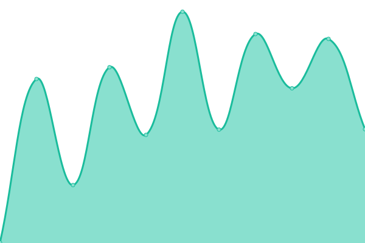

# [📈 Live Status](https://northwest-media-inland.github.io/nwm-upptime): <!--live status--> **🟩 All systems operational**

This repository contains the open-source uptime monitor and status page for [northwest-media-inland](https://northwest-media-inland.github.io/nwm-upptime), powered by [Upptime](https://github.com/upptime/upptime).

With [Upptime](https://upptime.js.org), you can get your own unlimited and free uptime monitor and status page, powered entirely by a GitHub repository. We use [Issues](https://github.com/northwest-media-inland/nwm-upptime/issues) as incident reports, [Actions](https://github.com/northwest-media-inland/nwm-upptime/actions) as uptime monitors, and [Pages](https://northwest-media-inland.github.io/nwm-upptime) for the status page.

<!--start: status pages-->
<!-- This summary is generated by Upptime (https://github.com/upptime/upptime) -->
<!-- Do not edit this manually, your changes will be overwritten -->
<!-- prettier-ignore -->
| URL | Status | History | Response Time | Uptime |
| --- | ------ | ------- | ------------- | ------ |
|  [208rvpark.com](https://208rvpark.com) | 🟩 Up | [208rvpark-com.yml](https://github.com/northwest-media-inland/nwm-upptime/commits/HEAD/history/208rvpark-com.yml) | 

 403ms
     
 | 

<a href="https://northwest-media-inland.github.io/nwm-upptime/history/208rvpark-com">100.00%</a>
    

|  [northwest.media](https://northwest.media) | 🟩 Up | [northwest-media.yml](https://github.com/northwest-media-inland/nwm-upptime/commits/HEAD/history/northwest-media.yml) | 

 533ms
     
 | 

<a href="https://northwest-media-inland.github.io/nwm-upptime/history/northwest-media">100.00%</a>
    

|  [a1mobilewelder.com](https://a1mobilewelder.com) | 🟩 Up | [a1mobilewelder-com.yml](https://github.com/northwest-media-inland/nwm-upptime/commits/HEAD/history/a1mobilewelder-com.yml) | 

 350ms
     
 | 

<a href="https://northwest-media-inland.github.io/nwm-upptime/history/a1mobilewelder-com">100.00%</a>
    

|  [a-rconst.com](https://a-rconst.com) | 🟩 Up | [a-rconst-com.yml](https://github.com/northwest-media-inland/nwm-upptime/commits/HEAD/history/a-rconst-com.yml) | 

 481ms
     
 | 

<a href="https://northwest-media-inland.github.io/nwm-upptime/history/a-rconst-com">100.00%</a>
    

|  [a1mobilewelder.com](https://a1mobilewelder.com) | 🟩 Up | [a1mobilewelder-com.yml](https://github.com/northwest-media-inland/nwm-upptime/commits/HEAD/history/a1mobilewelder-com.yml) | 

 350ms
     
 | 

<a href="https://northwest-media-inland.github.io/nwm-upptime/history/a1mobilewelder-com">100.00%</a>
    

|  [aeraexcavation.com](https://aeraexcavation.com) | 🟩 Up | [aeraexcavation-com.yml](https://github.com/northwest-media-inland/nwm-upptime/commits/HEAD/history/aeraexcavation-com.yml) | 

 1537ms
     
 | 

<a href="https://northwest-media-inland.github.io/nwm-upptime/history/aeraexcavation-com">100.00%</a>
    

|  [airportrentaspacellc.com](https://airportrentaspacellc.com) | 🟩 Up | [airportrentaspacellc-com.yml](https://github.com/northwest-media-inland/nwm-upptime/commits/HEAD/history/airportrentaspacellc-com.yml) | 

 504ms
     
 | 

<a href="https://northwest-media-inland.github.io/nwm-upptime/history/airportrentaspacellc-com">100.00%</a>
    

|  [animalclinic.org](https://animalclinic.org) | 🟩 Up | [animalclinic-org.yml](https://github.com/northwest-media-inland/nwm-upptime/commits/HEAD/history/animalclinic-org.yml) | 

 984ms
     
 | 

<a href="https://northwest-media-inland.github.io/nwm-upptime/history/animalclinic-org">100.00%</a>
    

|  [apetparlorofwa.com](https://apetparlorofwa.com) | 🟩 Up | [apetparlorofwa-com.yml](https://github.com/northwest-media-inland/nwm-upptime/commits/HEAD/history/apetparlorofwa-com.yml) | 

 2333ms
     
 | 

<a href="https://northwest-media-inland.github.io/nwm-upptime/history/apetparlorofwa-com">100.00%</a>
    

|  [arnzenconstruction.com](https://arnzenconstruction.com) | 🟩 Up | [arnzenconstruction-com.yml](https://github.com/northwest-media-inland/nwm-upptime/commits/HEAD/history/arnzenconstruction-com.yml) | 

 499ms
     
 | 

<a href="https://northwest-media-inland.github.io/nwm-upptime/history/arnzenconstruction-com">100.00%</a>
    

|  [artbeatinc.com](https://artbeatinc.com) | 🟩 Up | [artbeatinc-com.yml](https://github.com/northwest-media-inland/nwm-upptime/commits/HEAD/history/artbeatinc-com.yml) | 

 498ms
     
 | 

<a href="https://northwest-media-inland.github.io/nwm-upptime/history/artbeatinc-com">100.00%</a>
    

|  [asotincountyregionallandfill.com](https://asotincountyregionallandfill.com) | 🟩 Up | [asotincountyregionallandfill-com.yml](https://github.com/northwest-media-inland/nwm-upptime/commits/HEAD/history/asotincountyregionallandfill-com.yml) | 

 376ms
     
 | 

<a href="https://northwest-media-inland.github.io/nwm-upptime/history/asotincountyregionallandfill-com">100.00%</a>
    

|  [asotincountystormwater.com](https://asotincountystormwater.com) | 🟩 Up | [asotincountystormwater-com.yml](https://github.com/northwest-media-inland/nwm-upptime/commits/HEAD/history/asotincountystormwater-com.yml) | 

 468ms
     
 | 

<a href="https://northwest-media-inland.github.io/nwm-upptime/history/asotincountystormwater-com">100.00%</a>
    

|  [bandbpools.net](https://bandbpools.net) | 🟩 Up | [bandbpools-net.yml](https://github.com/northwest-media-inland/nwm-upptime/commits/HEAD/history/bandbpools-net.yml) | 

 499ms
     
 | 

<a href="https://northwest-media-inland.github.io/nwm-upptime/history/bandbpools-net">100.00%</a>
    

|  [beacon-christian.org](https://beacon-christian.org) | 🟩 Up | [beacon-christian-org.yml](https://github.com/northwest-media-inland/nwm-upptime/commits/HEAD/history/beacon-christian-org.yml) | 

 673ms
     
 | 

<a href="https://northwest-media-inland.github.io/nwm-upptime/history/beacon-christian-org">100.00%</a>
    

|  [beanmarinefabrication.com](https://beanmarinefabrication.com) | 🟩 Up | [beanmarinefabrication-com.yml](https://github.com/northwest-media-inland/nwm-upptime/commits/HEAD/history/beanmarinefabrication-com.yml) | 

 1688ms
     
 | 

<a href="https://northwest-media-inland.github.io/nwm-upptime/history/beanmarinefabrication-com">100.00%</a>
    

|  [bearabledentistry.com](https://bearabledentistry.com) | 🟩 Up | [bearabledentistry-com.yml](https://github.com/northwest-media-inland/nwm-upptime/commits/HEAD/history/bearabledentistry-com.yml) | 

 398ms
     
 | 

<a href="https://northwest-media-inland.github.io/nwm-upptime/history/bearabledentistry-com">100.00%</a>
    

|  [bestbuiltbuilderssupply.com](https://bestbuiltbuilderssupply.com) | 🟩 Up | [bestbuiltbuilderssupply-com.yml](https://github.com/northwest-media-inland/nwm-upptime/commits/HEAD/history/bestbuiltbuilderssupply-com.yml) | 

 480ms
     
 | 

<a href="https://northwest-media-inland.github.io/nwm-upptime/history/bestbuiltbuilderssupply-com">100.00%</a>
    

|  [bleedred.com](https://bleedred.com) | 🟩 Up | [bleedred-com.yml](https://github.com/northwest-media-inland/nwm-upptime/commits/HEAD/history/bleedred-com.yml) | 

 1074ms
     
 | 

<a href="https://northwest-media-inland.github.io/nwm-upptime/history/bleedred-com">100.00%</a>
    

|  [blpi.com](https://blpi.com) | 🟩 Up | [blpi-com.yml](https://github.com/northwest-media-inland/nwm-upptime/commits/HEAD/history/blpi-com.yml) | 

 527ms
     
 | 

<a href="https://northwest-media-inland.github.io/nwm-upptime/history/blpi-com">100.00%</a>
    

|  [blueribbonlinen.com](https://blueribbonlinen.com) | 🟩 Up | [blueribbonlinen-com.yml](https://github.com/northwest-media-inland/nwm-upptime/commits/HEAD/history/blueribbonlinen-com.yml) | 

 745ms
     
 | 

<a href="https://northwest-media-inland.github.io/nwm-upptime/history/blueribbonlinen-com">100.00%</a>
    

|  [bonebrakeconstruction.com](https://bonebrakeconstruction.com) | 🟩 Up | [bonebrakeconstruction-com.yml](https://github.com/northwest-media-inland/nwm-upptime/commits/HEAD/history/bonebrakeconstruction-com.yml) | 

 614ms
     
 | 

<a href="https://northwest-media-inland.github.io/nwm-upptime/history/bonebrakeconstruction-com">100.00%</a>
    

|  [borderline-lighting.com](https://borderline-lighting.com) | 🟩 Up | [borderline-lighting-com.yml](https://github.com/northwest-media-inland/nwm-upptime/commits/HEAD/history/borderline-lighting-com.yml) | 

 447ms
     
 | 

<a href="https://northwest-media-inland.github.io/nwm-upptime/history/borderline-lighting-com">100.00%</a>
    

|  [borderlinerivercharters.com](https://borderlinerivercharters.com) | 🟩 Up | [borderlinerivercharters-com.yml](https://github.com/northwest-media-inland/nwm-upptime/commits/HEAD/history/borderlinerivercharters-com.yml) | 

 813ms
     
 | 

<a href="https://northwest-media-inland.github.io/nwm-upptime/history/borderlinerivercharters-com">100.00%</a>
    

<!--end: status pages-->

[**Visit our status website →**](https://northwest-media-inland.github.io/nwm-upptime)

## 📄 License

- Powered by: [Upptime](https://github.com/upptime/upptime)
- Code: [MIT](./LICENSE) © [Anand Chowdhary](https://anandchowdhary.com), supported by [Pabio](https://pabio.com)
- Data in the `./history` directory: [Open Database License](https://opendatacommons.org/licenses/odbl/1-0/)
