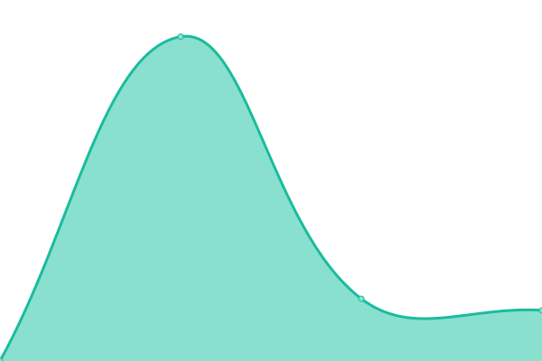

# [📈 Live Status](https://northwest-media-inland.github.io/nwm-upptime): <!--live status--> **🟩 All systems operational**

This repository contains the open-source uptime monitor and status page for [northwest-media-inland](https://northwest-media-inland.github.io/nwm-upptime), powered by [Upptime](https://github.com/upptime/upptime).

With [Upptime](https://upptime.js.org), you can get your own unlimited and free uptime monitor and status page, powered entirely by a GitHub repository. We use [Issues](https://github.com/northwest-media-inland/nwm-upptime/issues) as incident reports, [Actions](https://github.com/northwest-media-inland/nwm-upptime/actions) as uptime monitors, and [Pages](https://northwest-media-inland.github.io/nwm-upptime) for the status page.

<!--start: status pages-->
<!-- This summary is generated by Upptime (https://github.com/upptime/upptime) -->
<!-- Do not edit this manually, your changes will be overwritten -->
<!-- prettier-ignore -->
| URL | Status | History | Response Time | Uptime |
| --- | ------ | ------- | ------------- | ------ |
|  [208rvpark.com](https://208rvpark.com) | 🟩 Up | [208rvpark-com.yml](https://github.com/northwest-media-inland/nwm-upptime/commits/HEAD/history/208rvpark-com.yml) | 

 418ms
     
 | 

<a href="https://northwest-media-inland.github.io/nwm-upptime/history/208rvpark-com">100.00%</a>
    

|  [northwest.media](https://northwest.media) | 🟩 Up | [northwest-media.yml](https://github.com/northwest-media-inland/nwm-upptime/commits/HEAD/history/northwest-media.yml) | 

 542ms
     
 | 

<a href="https://northwest-media-inland.github.io/nwm-upptime/history/northwest-media">100.00%</a>
    

|  [a1mobilewelder.com](https://a1mobilewelder.com) | 🟩 Up | [a1mobilewelder-com.yml](https://github.com/northwest-media-inland/nwm-upptime/commits/HEAD/history/a1mobilewelder-com.yml) | 

 375ms
     
 | 

<a href="https://northwest-media-inland.github.io/nwm-upptime/history/a1mobilewelder-com">100.00%</a>
    

|  [a-rconst.com](https://a-rconst.com) | 🟩 Up | [a-rconst-com.yml](https://github.com/northwest-media-inland/nwm-upptime/commits/HEAD/history/a-rconst-com.yml) | 

 459ms
     
 | 

<a href="https://northwest-media-inland.github.io/nwm-upptime/history/a-rconst-com">100.00%</a>
    

|  [a1mobilewelder.com](https://a1mobilewelder.com) | 🟩 Up | [a1mobilewelder-com.yml](https://github.com/northwest-media-inland/nwm-upptime/commits/HEAD/history/a1mobilewelder-com.yml) | 

 375ms
     
 | 

<a href="https://northwest-media-inland.github.io/nwm-upptime/history/a1mobilewelder-com">100.00%</a>
    

|  [aeraexcavation.com](https://aeraexcavation.com) | 🟩 Up | [aeraexcavation-com.yml](https://github.com/northwest-media-inland/nwm-upptime/commits/HEAD/history/aeraexcavation-com.yml) | 

 1560ms
     
 | 

<a href="https://northwest-media-inland.github.io/nwm-upptime/history/aeraexcavation-com">100.00%</a>
    

|  [airportrentaspacellc.com](https://airportrentaspacellc.com) | 🟩 Up | [airportrentaspacellc-com.yml](https://github.com/northwest-media-inland/nwm-upptime/commits/HEAD/history/airportrentaspacellc-com.yml) | 

 506ms
     
 | 

<a href="https://northwest-media-inland.github.io/nwm-upptime/history/airportrentaspacellc-com">100.00%</a>
    

|  [animalclinic.org](https://animalclinic.org) | 🟩 Up | [animalclinic-org.yml](https://github.com/northwest-media-inland/nwm-upptime/commits/HEAD/history/animalclinic-org.yml) | 

 1068ms
     
 | 

<a href="https://northwest-media-inland.github.io/nwm-upptime/history/animalclinic-org">100.00%</a>
    

|  [apetparlorofwa.com](https://apetparlorofwa.com) | 🟩 Up | [apetparlorofwa-com.yml](https://github.com/northwest-media-inland/nwm-upptime/commits/HEAD/history/apetparlorofwa-com.yml) | 

 2166ms
     
 | 

<a href="https://northwest-media-inland.github.io/nwm-upptime/history/apetparlorofwa-com">100.00%</a>
    

|  [arnzenconstruction.com](https://arnzenconstruction.com) | 🟩 Up | [arnzenconstruction-com.yml](https://github.com/northwest-media-inland/nwm-upptime/commits/HEAD/history/arnzenconstruction-com.yml) | 

 495ms
     
 | 

<a href="https://northwest-media-inland.github.io/nwm-upptime/history/arnzenconstruction-com">100.00%</a>
    

|  [artbeatinc.com](https://artbeatinc.com) | 🟩 Up | [artbeatinc-com.yml](https://github.com/northwest-media-inland/nwm-upptime/commits/HEAD/history/artbeatinc-com.yml) | 

 518ms
     
 | 

<a href="https://northwest-media-inland.github.io/nwm-upptime/history/artbeatinc-com">100.00%</a>
    

|  [asotincountyregionallandfill.com](https://asotincountyregionallandfill.com) | 🟩 Up | [asotincountyregionallandfill-com.yml](https://github.com/northwest-media-inland/nwm-upptime/commits/HEAD/history/asotincountyregionallandfill-com.yml) | 

 387ms
     
 | 

<a href="https://northwest-media-inland.github.io/nwm-upptime/history/asotincountyregionallandfill-com">100.00%</a>
    

|  [asotincountystormwater.com](https://asotincountystormwater.com) | 🟩 Up | [asotincountystormwater-com.yml](https://github.com/northwest-media-inland/nwm-upptime/commits/HEAD/history/asotincountystormwater-com.yml) | 

 459ms
     
 | 

<a href="https://northwest-media-inland.github.io/nwm-upptime/history/asotincountystormwater-com">100.00%</a>
    

|  [bandbpools.net](https://bandbpools.net) | 🟩 Up | [bandbpools-net.yml](https://github.com/northwest-media-inland/nwm-upptime/commits/HEAD/history/bandbpools-net.yml) | 

 486ms
     
 | 

<a href="https://northwest-media-inland.github.io/nwm-upptime/history/bandbpools-net">100.00%</a>
    

|  [beacon-christian.org](https://beacon-christian.org) | 🟩 Up | [beacon-christian-org.yml](https://github.com/northwest-media-inland/nwm-upptime/commits/HEAD/history/beacon-christian-org.yml) | 

 693ms
     
 | 

<a href="https://northwest-media-inland.github.io/nwm-upptime/history/beacon-christian-org">100.00%</a>
    

|  [beanmarinefabrication.com](https://beanmarinefabrication.com) | 🟩 Up | [beanmarinefabrication-com.yml](https://github.com/northwest-media-inland/nwm-upptime/commits/HEAD/history/beanmarinefabrication-com.yml) | 

 1735ms
     
 | 

<a href="https://northwest-media-inland.github.io/nwm-upptime/history/beanmarinefabrication-com">100.00%</a>
    

|  [bearabledentistry.com](https://bearabledentistry.com) | 🟩 Up | [bearabledentistry-com.yml](https://github.com/northwest-media-inland/nwm-upptime/commits/HEAD/history/bearabledentistry-com.yml) | 

 399ms
     
 | 

<a href="https://northwest-media-inland.github.io/nwm-upptime/history/bearabledentistry-com">100.00%</a>
    

|  [bestbuiltbuilderssupply.com](https://bestbuiltbuilderssupply.com) | 🟩 Up | [bestbuiltbuilderssupply-com.yml](https://github.com/northwest-media-inland/nwm-upptime/commits/HEAD/history/bestbuiltbuilderssupply-com.yml) | 

 480ms
     
 | 

<a href="https://northwest-media-inland.github.io/nwm-upptime/history/bestbuiltbuilderssupply-com">100.00%</a>
    

|  [bleedred.com](https://bleedred.com) | 🟩 Up | [bleedred-com.yml](https://github.com/northwest-media-inland/nwm-upptime/commits/HEAD/history/bleedred-com.yml) | 

 1087ms
     
 | 

<a href="https://northwest-media-inland.github.io/nwm-upptime/history/bleedred-com">100.00%</a>
    

|  [blpi.com](https://blpi.com) | 🟩 Up | [blpi-com.yml](https://github.com/northwest-media-inland/nwm-upptime/commits/HEAD/history/blpi-com.yml) | 

 559ms
     
 | 

<a href="https://northwest-media-inland.github.io/nwm-upptime/history/blpi-com">100.00%</a>
    

|  [blueribbonlinen.com](https://blueribbonlinen.com) | 🟩 Up | [blueribbonlinen-com.yml](https://github.com/northwest-media-inland/nwm-upptime/commits/HEAD/history/blueribbonlinen-com.yml) | 

 1341ms
     
 | 

<a href="https://northwest-media-inland.github.io/nwm-upptime/history/blueribbonlinen-com">100.00%</a>
    

|  [bonebrakeconstruction.com](https://bonebrakeconstruction.com) | 🟩 Up | [bonebrakeconstruction-com.yml](https://github.com/northwest-media-inland/nwm-upptime/commits/HEAD/history/bonebrakeconstruction-com.yml) | 

 579ms
     
 | 

<a href="https://northwest-media-inland.github.io/nwm-upptime/history/bonebrakeconstruction-com">100.00%</a>
    

|  [borderline-lighting.com](https://borderline-lighting.com) | 🟩 Up | [borderline-lighting-com.yml](https://github.com/northwest-media-inland/nwm-upptime/commits/HEAD/history/borderline-lighting-com.yml) | 

 517ms
     
 | 

<a href="https://northwest-media-inland.github.io/nwm-upptime/history/borderline-lighting-com">100.00%</a>
    

|  [borderlinerivercharters.com](https://borderlinerivercharters.com) | 🟩 Up | [borderlinerivercharters-com.yml](https://github.com/northwest-media-inland/nwm-upptime/commits/HEAD/history/borderlinerivercharters-com.yml) | 

 868ms
     
 | 

<a href="https://northwest-media-inland.github.io/nwm-upptime/history/borderlinerivercharters-com">100.00%</a>
    

|  [bravaslewiston.com](https://bravaslewiston.com) | 🟩 Up | [bravaslewiston-com.yml](https://github.com/northwest-media-inland/nwm-upptime/commits/HEAD/history/bravaslewiston-com.yml) | 

 495ms
     
 | 

<a href="https://northwest-media-inland.github.io/nwm-upptime/history/bravaslewiston-com">100.00%</a>
    

|  [buildingblockspt.com](https://buildingblockspt.com) | 🟩 Up | [buildingblockspt-com.yml](https://github.com/northwest-media-inland/nwm-upptime/commits/HEAD/history/buildingblockspt-com.yml) | 

 416ms
     
 | 

<a href="https://northwest-media-inland.github.io/nwm-upptime/history/buildingblockspt-com">100.00%</a>
    

|  [burlingamemachine.com](https://burlingamemachine.com) | 🟩 Up | [burlingamemachine-com.yml](https://github.com/northwest-media-inland/nwm-upptime/commits/HEAD/history/burlingamemachine-com.yml) | 

 4168ms
     
 | 

<a href="https://northwest-media-inland.github.io/nwm-upptime/history/burlingamemachine-com">100.00%</a>
    

|  [calamshriners.com](https://calamshriners.com) | 🟩 Up | [calamshriners-com.yml](https://github.com/northwest-media-inland/nwm-upptime/commits/HEAD/history/calamshriners-com.yml) | 

 2075ms
     
 | 

<a href="https://northwest-media-inland.github.io/nwm-upptime/history/calamshriners-com">100.00%</a>
    

|  [cambio.design](https://cambio.design) | 🟩 Up | [cambio-design.yml](https://github.com/northwest-media-inland/nwm-upptime/commits/HEAD/history/cambio-design.yml) | 

 2303ms
     
 | 

<a href="https://northwest-media-inland.github.io/nwm-upptime/history/cambio-design">100.00%</a>
    

|  [candbmusic.com](https://candbmusic.com) | 🟩 Up | [candbmusic-com.yml](https://github.com/northwest-media-inland/nwm-upptime/commits/HEAD/history/candbmusic-com.yml) | 

 571ms
     
 | 

<a href="https://northwest-media-inland.github.io/nwm-upptime/history/candbmusic-com">100.00%</a>
    

|  [cap4action.org](https://cap4action.org) | 🟩 Up | [cap4action-org.yml](https://github.com/northwest-media-inland/nwm-upptime/commits/HEAD/history/cap4action-org.yml) | 

 1800ms
     
 | 

<a href="https://northwest-media-inland.github.io/nwm-upptime/history/cap4action-org">100.00%</a>
    

|  [castillodefeliciana.com](https://castillodefeliciana.com) | 🟩 Up | [castillodefeliciana-com.yml](https://github.com/northwest-media-inland/nwm-upptime/commits/HEAD/history/castillodefeliciana-com.yml) | 

 478ms
     
 | 

<a href="https://northwest-media-inland.github.io/nwm-upptime/history/castillodefeliciana-com">100.00%</a>
    

|  [cityofgenesee.com](https://cityofgenesee.com) | 🟩 Up | [cityofgenesee-com.yml](https://github.com/northwest-media-inland/nwm-upptime/commits/HEAD/history/cityofgenesee-com.yml) | 

 458ms
     
 | 

<a href="https://northwest-media-inland.github.io/nwm-upptime/history/cityofgenesee-com">100.00%</a>
    

|  [clarkandfeeney.com](https://clarkandfeeney.com) | 🟩 Up | [clarkandfeeney-com.yml](https://github.com/northwest-media-inland/nwm-upptime/commits/HEAD/history/clarkandfeeney-com.yml) | 

 452ms
     
 | 

<a href="https://northwest-media-inland.github.io/nwm-upptime/history/clarkandfeeney-com">100.00%</a>
    

|  [clarkston-wa.com](https://clarkston-wa.com) | 🟩 Up | [clarkston-wa-com.yml](https://github.com/northwest-media-inland/nwm-upptime/commits/HEAD/history/clarkston-wa-com.yml) | 

 486ms
     
 | 

<a href="https://northwest-media-inland.github.io/nwm-upptime/history/clarkston-wa-com">100.00%</a>
    

|  [clarkstoneducationfoundation.org](https://clarkstoneducationfoundation.org) | 🟩 Up | [clarkstoneducationfoundation-org.yml](https://github.com/northwest-media-inland/nwm-upptime/commits/HEAD/history/clarkstoneducationfoundation-org.yml) | 

 568ms
     
 | 

<a href="https://northwest-media-inland.github.io/nwm-upptime/history/clarkstoneducationfoundation-org">100.00%</a>
    

|  [clearwatercanyoncellars.com](https://clearwatercanyoncellars.com) | 🟩 Up | [clearwatercanyoncellars-com.yml](https://github.com/northwest-media-inland/nwm-upptime/commits/HEAD/history/clearwatercanyoncellars-com.yml) | 

 400ms
     
 | 

<a href="https://northwest-media-inland.github.io/nwm-upptime/history/clearwatercanyoncellars-com">100.00%</a>
    

|  [clearwaterfarms.us](https://clearwaterfarms.us) | 🟩 Up | [clearwaterfarms-us.yml](https://github.com/northwest-media-inland/nwm-upptime/commits/HEAD/history/clearwaterfarms-us.yml) | 

 753ms
     
 | 

<a href="https://northwest-media-inland.github.io/nwm-upptime/history/clearwaterfarms-us">100.00%</a>
    

|  [cookscarco.com](https://cookscarco.com) | 🟩 Up | [cookscarco-com.yml](https://github.com/northwest-media-inland/nwm-upptime/commits/HEAD/history/cookscarco-com.yml) | 

 352ms
     
 | 

<a href="https://northwest-media-inland.github.io/nwm-upptime/history/cookscarco-com">100.00%</a>
    

|  [costasautorepair.com](https://costasautorepair.com) | 🟩 Up | [costasautorepair-com.yml](https://github.com/northwest-media-inland/nwm-upptime/commits/HEAD/history/costasautorepair-com.yml) | 

 362ms
     
 | 

<a href="https://northwest-media-inland.github.io/nwm-upptime/history/costasautorepair-com">100.00%</a>
    

|  [covermetees.com](https://covermetees.com/) | 🟩 Up | [covermetees-com.yml](https://github.com/northwest-media-inland/nwm-upptime/commits/HEAD/history/covermetees-com.yml) | 

 1871ms
     
 | 

<a href="https://northwest-media-inland.github.io/nwm-upptime/history/covermetees-com">100.00%</a>
    

|  [crsupplements.com](https://crsupplements.com) | 🟩 Up | [crsupplements-com.yml](https://github.com/northwest-media-inland/nwm-upptime/commits/HEAD/history/crsupplements-com.yml) | 

 567ms
     
 | 

<a href="https://northwest-media-inland.github.io/nwm-upptime/history/crsupplements-com">100.00%</a>
    

|  [davesgolfonline.com](https://davesgolfonline.com) | 🟩 Up | [davesgolfonline-com.yml](https://github.com/northwest-media-inland/nwm-upptime/commits/HEAD/history/davesgolfonline-com.yml) | 

 515ms
     
 | 

<a href="https://northwest-media-inland.github.io/nwm-upptime/history/davesgolfonline-com">100.00%</a>
    

|  [daytonlodge.com](https://daytonlodge.com) | 🟩 Up | [daytonlodge-com.yml](https://github.com/northwest-media-inland/nwm-upptime/commits/HEAD/history/daytonlodge-com.yml) | 

 525ms
     
 | 

<a href="https://northwest-media-inland.github.io/nwm-upptime/history/daytonlodge-com">100.00%</a>
    

|  [debcousa.com](https://debcousa.com) | 🟩 Up | [debcousa-com.yml](https://github.com/northwest-media-inland/nwm-upptime/commits/HEAD/history/debcousa-com.yml) | 

 505ms
     
 | 

<a href="https://northwest-media-inland.github.io/nwm-upptime/history/debcousa-com">100.00%</a>
    

|  [dicksonreadymix.com](https://dicksonreadymix.com) | 🟩 Up | [dicksonreadymix-com.yml](https://github.com/northwest-media-inland/nwm-upptime/commits/HEAD/history/dicksonreadymix-com.yml) | 

 392ms
     
 | 

<a href="https://northwest-media-inland.github.io/nwm-upptime/history/dicksonreadymix-com">100.00%</a>
    

|  [dkmullin.com](https://dkmullin.com) | 🟩 Up | [dkmullin-com.yml](https://github.com/northwest-media-inland/nwm-upptime/commits/HEAD/history/dkmullin-com.yml) | 

 2045ms
     
 | 

<a href="https://northwest-media-inland.github.io/nwm-upptime/history/dkmullin-com">100.00%</a>
    

|  [doublebarrelexpress.com](https://doublebarrelexpress.com) | 🟩 Up | [doublebarrelexpress-com.yml](https://github.com/northwest-media-inland/nwm-upptime/commits/HEAD/history/doublebarrelexpress-com.yml) | 

 414ms
     
 | 

<a href="https://northwest-media-inland.github.io/nwm-upptime/history/doublebarrelexpress-com">100.00%</a>
    

|  [douglasslawfirm.net](https://douglasslawfirm.net) | 🟩 Up | [douglasslawfirm-net.yml](https://github.com/northwest-media-inland/nwm-upptime/commits/HEAD/history/douglasslawfirm-net.yml) | 

 1281ms
     
 | 

<a href="https://northwest-media-inland.github.io/nwm-upptime/history/douglasslawfirm-net">100.00%</a>
    

|  [dropforgeleathercare.com](https://dropforgeleathercare.com) | 🟩 Up | [dropforgeleathercare-com.yml](https://github.com/northwest-media-inland/nwm-upptime/commits/HEAD/history/dropforgeleathercare-com.yml) | 

 3896ms
     
 | 

<a href="https://northwest-media-inland.github.io/nwm-upptime/history/dropforgeleathercare-com">100.00%</a>
    

|  [dropforgewoodcare.com](https://dropforgewoodcare.com) | 🟩 Up | [dropforgewoodcare-com.yml](https://github.com/northwest-media-inland/nwm-upptime/commits/HEAD/history/dropforgewoodcare-com.yml) | 

 766ms
     
 | 

<a href="https://northwest-media-inland.github.io/nwm-upptime/history/dropforgewoodcare-com">100.00%</a>
    

|  [dyehardllc.com](https://dyehardllc.com) | 🟩 Up | [dyehardllc-com.yml](https://github.com/northwest-media-inland/nwm-upptime/commits/HEAD/history/dyehardllc-com.yml) | 

 556ms
     
 | 

<a href="https://northwest-media-inland.github.io/nwm-upptime/history/dyehardllc-com">100.00%</a>
    

|  [ecmxpark.com](https://ecmxpark.com) | 🟩 Up | [ecmxpark-com.yml](https://github.com/northwest-media-inland/nwm-upptime/commits/HEAD/history/ecmxpark-com.yml) | 

 2246ms
     
 | 

<a href="https://northwest-media-inland.github.io/nwm-upptime/history/ecmxpark-com">100.00%</a>
    

|  [evergem.com](https://evergem.com) | 🟩 Up | [evergem-com.yml](https://github.com/northwest-media-inland/nwm-upptime/commits/HEAD/history/evergem-com.yml) | 

 495ms
     
 | 

<a href="https://northwest-media-inland.github.io/nwm-upptime/history/evergem-com">100.00%</a>
    

|  [everybody-reads.org](https://everybody-reads.org) | 🟩 Up | [everybody-reads-org.yml](https://github.com/northwest-media-inland/nwm-upptime/commits/HEAD/history/everybody-reads-org.yml) | 

 586ms
     
 | 

<a href="https://northwest-media-inland.github.io/nwm-upptime/history/everybody-reads-org">100.00%</a>
    

|  [fishersystems.com](https://fishersystems.com) | 🟩 Up | [fishersystems-com.yml](https://github.com/northwest-media-inland/nwm-upptime/commits/HEAD/history/fishersystems-com.yml) | 

 393ms
     
 | 

<a href="https://northwest-media-inland.github.io/nwm-upptime/history/fishersystems-com">100.00%</a>
    

|  [forum.hotwiredirect.com](https://forum.hotwiredirect.com) | 🟩 Up | [forum-hotwiredirect-com.yml](https://github.com/northwest-media-inland/nwm-upptime/commits/HEAD/history/forum-hotwiredirect-com.yml) | 

 645ms
     
 | 

<a href="https://northwest-media-inland.github.io/nwm-upptime/history/forum-hotwiredirect-com">100.00%</a>
    

|  [framedbykane.com](https://framedbykane.com) | 🟩 Up | [framedbykane-com.yml](https://github.com/northwest-media-inland/nwm-upptime/commits/HEAD/history/framedbykane-com.yml) | 

 1951ms
     
 | 

<a href="https://northwest-media-inland.github.io/nwm-upptime/history/framedbykane-com">100.00%</a>
    

|  [framewrk.us](https://framewrk.us) | 🟩 Up | [framewrk-us.yml](https://github.com/northwest-media-inland/nwm-upptime/commits/HEAD/history/framewrk-us.yml) | 

 392ms
     
 | 

<a href="https://northwest-media-inland.github.io/nwm-upptime/history/framewrk-us">100.00%</a>
    

|  [fritzprecisionshooting.com](https://fritzprecisionshooting.com) | 🟩 Up | [fritzprecisionshooting-com.yml](https://github.com/northwest-media-inland/nwm-upptime/commits/HEAD/history/fritzprecisionshooting-com.yml) | 

 556ms
     
 | 

<a href="https://northwest-media-inland.github.io/nwm-upptime/history/fritzprecisionshooting-com">100.00%</a>
    

|  [garfieldcta.com](https://garfieldcta.com) | 🟩 Up | [garfieldcta-com.yml](https://github.com/northwest-media-inland/nwm-upptime/commits/HEAD/history/garfieldcta-com.yml) | 

 463ms
     
 | 

<a href="https://northwest-media-inland.github.io/nwm-upptime/history/garfieldcta-com">100.00%</a>
    

|  [gateway-materials.com](https://gateway-materials.com) | 🟩 Up | [gateway-materials-com.yml](https://github.com/northwest-media-inland/nwm-upptime/commits/HEAD/history/gateway-materials-com.yml) | 

 500ms
     
 | 

<a href="https://northwest-media-inland.github.io/nwm-upptime/history/gateway-materials-com">100.00%</a>
    

|  [gatewaycustomdecking.com](https://gatewaycustomdecking.com) | 🟩 Up | [gatewaycustomdecking-com.yml](https://github.com/northwest-media-inland/nwm-upptime/commits/HEAD/history/gatewaycustomdecking-com.yml) | 

 485ms
     
 | 

<a href="https://northwest-media-inland.github.io/nwm-upptime/history/gatewaycustomdecking-com">100.00%</a>
    

|  [gatewaywinchester.com](https://gatewaywinchester.com) | 🟩 Up | [gatewaywinchester-com.yml](https://github.com/northwest-media-inland/nwm-upptime/commits/HEAD/history/gatewaywinchester-com.yml) | 

 435ms
     
 | 

<a href="https://northwest-media-inland.github.io/nwm-upptime/history/gatewaywinchester-com">100.00%</a>
    

|  [gid-mt.org](https://gid-mt.org) | 🟩 Up | [gid-mt-org.yml](https://github.com/northwest-media-inland/nwm-upptime/commits/HEAD/history/gid-mt-org.yml) | 

 532ms
     
 | 

<a href="https://northwest-media-inland.github.io/nwm-upptime/history/gid-mt-org">100.00%</a>
    

|  [golflgcc.com](https://golflgcc.com) | 🟩 Up | [golflgcc-com.yml](https://github.com/northwest-media-inland/nwm-upptime/commits/HEAD/history/golflgcc-com.yml) | 

 477ms
     
 | 

<a href="https://northwest-media-inland.github.io/nwm-upptime/history/golflgcc-com">100.00%</a>
    

|  [golfscoring.com](https://golfscoring.com) | 🟩 Up | [golfscoring-com.yml](https://github.com/northwest-media-inland/nwm-upptime/commits/HEAD/history/golfscoring-com.yml) | 

 416ms
     
 | 

<a href="https://northwest-media-inland.github.io/nwm-upptime/history/golfscoring-com">100.00%</a>
    

|  [golws.com](https://golws.com) | 🟩 Up | [golws-com.yml](https://github.com/northwest-media-inland/nwm-upptime/commits/HEAD/history/golws-com.yml) | 

 1503ms
     
 | 

<a href="https://northwest-media-inland.github.io/nwm-upptime/history/golws-com">100.00%</a>
    

|  [greco-construction.com](https://greco-construction.com) | 🟩 Up | [greco-construction-com.yml](https://github.com/northwest-media-inland/nwm-upptime/commits/HEAD/history/greco-construction-com.yml) | 

 494ms
     
 | 

<a href="https://northwest-media-inland.github.io/nwm-upptime/history/greco-construction-com">100.00%</a>
    

|  [greenshirts.net](https://greenshirts.net) | 🟩 Up | [greenshirts-net.yml](https://github.com/northwest-media-inland/nwm-upptime/commits/HEAD/history/greenshirts-net.yml) | 

 367ms
     
 | 

<a href="https://northwest-media-inland.github.io/nwm-upptime/history/greenshirts-net">100.00%</a>
    

|  [hayeshouseclarkston.com](https://hayeshouseclarkston.com) | 🟩 Up | [hayeshouseclarkston-com.yml](https://github.com/northwest-media-inland/nwm-upptime/commits/HEAD/history/hayeshouseclarkston-com.yml) | 

 561ms
     
 | 

<a href="https://northwest-media-inland.github.io/nwm-upptime/history/hayeshouseclarkston-com">100.00%</a>
    

|  [hellscanyonapparel.com](https://hellscanyonapparel.com) | 🟩 Up | [hellscanyonapparel-com.yml](https://github.com/northwest-media-inland/nwm-upptime/commits/HEAD/history/hellscanyonapparel-com.yml) | 

 497ms
     
 | 

<a href="https://northwest-media-inland.github.io/nwm-upptime/history/hellscanyonapparel-com">100.00%</a>
    

|  [helpinghandsrescue.org](https://helpinghandsrescue.org) | 🟩 Up | [helpinghandsrescue-org.yml](https://github.com/northwest-media-inland/nwm-upptime/commits/HEAD/history/helpinghandsrescue-org.yml) | 

 629ms
     
 | 

<a href="https://northwest-media-inland.github.io/nwm-upptime/history/helpinghandsrescue-org">100.00%</a>
    

|  [hermistontrailers.com](https://hermistontrailers.com) | 🟩 Up | [hermistontrailers-com.yml](https://github.com/northwest-media-inland/nwm-upptime/commits/HEAD/history/hermistontrailers-com.yml) | 

 492ms
     
 | 

<a href="https://northwest-media-inland.github.io/nwm-upptime/history/hermistontrailers-com">100.00%</a>
    

|  [holyfamilyclarkston.com](https://holyfamilyclarkston.com) | 🟩 Up | [holyfamilyclarkston-com.yml](https://github.com/northwest-media-inland/nwm-upptime/commits/HEAD/history/holyfamilyclarkston-com.yml) | 

 2279ms
     
 | 

<a href="https://northwest-media-inland.github.io/nwm-upptime/history/holyfamilyclarkston-com">100.00%</a>
    

|  [homesatcanyoncrest.com](https://homesatcanyoncrest.com) | 🟩 Up | [homesatcanyoncrest-com.yml](https://github.com/northwest-media-inland/nwm-upptime/commits/HEAD/history/homesatcanyoncrest-com.yml) | 

 451ms
     
 | 

<a href="https://northwest-media-inland.github.io/nwm-upptime/history/homesatcanyoncrest-com">100.00%</a>
    

|  [hotwiredirect.com](https://hotwiredirect.com) | 🟩 Up | [hotwiredirect-com.yml](https://github.com/northwest-media-inland/nwm-upptime/commits/HEAD/history/hotwiredirect-com.yml) | 

 682ms
     
 | 

<a href="https://northwest-media-inland.github.io/nwm-upptime/history/hotwiredirect-com">100.00%</a>
    

|  [hudsonslandscaping.com](https://hudsonslandscaping.com) | 🟩 Up | [hudsonslandscaping-com.yml](https://github.com/northwest-media-inland/nwm-upptime/commits/HEAD/history/hudsonslandscaping-com.yml) | 

 1474ms
     
 | 

<a href="https://northwest-media-inland.github.io/nwm-upptime/history/hudsonslandscaping-com">100.00%</a>
    

|  [iclowdown.com](https://iclowdown.com) | 🟩 Up | [iclowdown-com.yml](https://github.com/northwest-media-inland/nwm-upptime/commits/HEAD/history/iclowdown-com.yml) | 

 2110ms
     
 | 

<a href="https://northwest-media-inland.github.io/nwm-upptime/history/iclowdown-com">100.00%</a>
    

|  [idahofirewise.org](https://idahofirewise.org) | 🟩 Up | [idahofirewise-org.yml](https://github.com/northwest-media-inland/nwm-upptime/commits/HEAD/history/idahofirewise-org.yml) | 

 595ms
     
 | 

<a href="https://northwest-media-inland.github.io/nwm-upptime/history/idahofirewise-org">100.00%</a>
    

|  [idahotrucksales.com](https://idahotrucksales.com) | 🟩 Up | [idahotrucksales-com.yml](https://github.com/northwest-media-inland/nwm-upptime/commits/HEAD/history/idahotrucksales-com.yml) | 

 502ms
     
 | 

<a href="https://northwest-media-inland.github.io/nwm-upptime/history/idahotrucksales-com">100.00%</a>
    

|  [imiproperties.com](https://imiproperties.com) | 🟩 Up | [imiproperties-com.yml](https://github.com/northwest-media-inland/nwm-upptime/commits/HEAD/history/imiproperties-com.yml) | 

 403ms
     
 | 

<a href="https://northwest-media-inland.github.io/nwm-upptime/history/imiproperties-com">100.00%</a>
    

|  [improvelivingston.com](https://improvelivingston.com) | 🟩 Up | [improvelivingston-com.yml](https://github.com/northwest-media-inland/nwm-upptime/commits/HEAD/history/improvelivingston-com.yml) | 

 443ms
     
 | 

<a href="https://northwest-media-inland.github.io/nwm-upptime/history/improvelivingston-com">100.00%</a>
    

|  [imualcv.com](https://imualcv.com) | 🟩 Up | [imualcv-com.yml](https://github.com/northwest-media-inland/nwm-upptime/commits/HEAD/history/imualcv-com.yml) | 

 441ms
     
 | 

<a href="https://northwest-media-inland.github.io/nwm-upptime/history/imualcv-com">100.00%</a>
    

|  [inlandcell.com](inlandcell.com) | 🟩 Up | [inlandcell-com.yml](https://github.com/northwest-media-inland/nwm-upptime/commits/HEAD/history/inlandcell-com.yml) | 

 295ms
     
 | 

<a href="https://northwest-media-inland.github.io/nwm-upptime/history/inlandcell-com">100.00%</a>
    

|  [intermountainfeed.com](https://intermountainfeed.com) | 🟩 Up | [intermountainfeed-com.yml](https://github.com/northwest-media-inland/nwm-upptime/commits/HEAD/history/intermountainfeed-com.yml) | 

 1867ms
     
 | 

<a href="https://northwest-media-inland.github.io/nwm-upptime/history/intermountainfeed-com">100.00%</a>
    

|  [jacksonspayitforward.com](https://jacksonspayitforward.com) | 🟩 Up | [jacksonspayitforward-com.yml](https://github.com/northwest-media-inland/nwm-upptime/commits/HEAD/history/jacksonspayitforward-com.yml) | 

 530ms
     
 | 

<a href="https://northwest-media-inland.github.io/nwm-upptime/history/jacksonspayitforward-com">100.00%</a>
    

|  [javastopespresso.com](https://javastopespresso.com) | 🟩 Up | [javastopespresso-com.yml](https://github.com/northwest-media-inland/nwm-upptime/commits/HEAD/history/javastopespresso-com.yml) | 

 457ms
     
 | 

<a href="https://northwest-media-inland.github.io/nwm-upptime/history/javastopespresso-com">100.00%</a>
    

|  [jrass.net](https://jrass.net) | 🟩 Up | [jrass-net.yml](https://github.com/northwest-media-inland/nwm-upptime/commits/HEAD/history/jrass-net.yml) | 

 475ms
     
 | 

<a href="https://northwest-media-inland.github.io/nwm-upptime/history/jrass-net">100.00%</a>
    

|  [jrussellexcavation.com](https://jrussellexcavation.com) | 🟩 Up | [jrussellexcavation-com.yml](https://github.com/northwest-media-inland/nwm-upptime/commits/HEAD/history/jrussellexcavation-com.yml) | 

 450ms
     
 | 

<a href="https://northwest-media-inland.github.io/nwm-upptime/history/jrussellexcavation-com">100.00%</a>
    

|  [justbreatherdh.com](https://justbreatherdh.com) | 🟩 Up | [justbreatherdh-com.yml](https://github.com/northwest-media-inland/nwm-upptime/commits/HEAD/history/justbreatherdh-com.yml) | 

 447ms
     
 | 

<a href="https://northwest-media-inland.github.io/nwm-upptime/history/justbreatherdh-com">100.00%</a>
    

|  [kandgconstructionllc.com](https://kandgconstructionllc.com) | 🟩 Up | [kandgconstructionllc-com.yml](https://github.com/northwest-media-inland/nwm-upptime/commits/HEAD/history/kandgconstructionllc-com.yml) | 

 462ms
     
 | 

<a href="https://northwest-media-inland.github.io/nwm-upptime/history/kandgconstructionllc-com">100.00%</a>
    

|  [kingsthrones.com](https://kingsthrones.com) | 🟩 Up | [kingsthrones-com.yml](https://github.com/northwest-media-inland/nwm-upptime/commits/HEAD/history/kingsthrones-com.yml) | 

 488ms
     
 | 

<a href="https://northwest-media-inland.github.io/nwm-upptime/history/kingsthrones-com">100.00%</a>
    

|  [larsoncabinetcompany.com](https://larsoncabinetcompany.com) | 🟩 Up | [larsoncabinetcompany-com.yml](https://github.com/northwest-media-inland/nwm-upptime/commits/HEAD/history/larsoncabinetcompany-com.yml) | 

 385ms
     
 | 

<a href="https://northwest-media-inland.github.io/nwm-upptime/history/larsoncabinetcompany-com">100.00%</a>
    

|  [lccrew.com](https://lccrew.com) | 🟩 Up | [lccrew-com.yml](https://github.com/northwest-media-inland/nwm-upptime/commits/HEAD/history/lccrew-com.yml) | 

 1952ms
     
 | 

<a href="https://northwest-media-inland.github.io/nwm-upptime/history/lccrew-com">100.00%</a>
    

|  [lctheatre.org](https://lctheatre.org) | 🟩 Up | [lctheatre-org.yml](https://github.com/northwest-media-inland/nwm-upptime/commits/HEAD/history/lctheatre-org.yml) | 

 753ms
     
 | 

<a href="https://northwest-media-inland.github.io/nwm-upptime/history/lctheatre-org">100.00%</a>
    

<!--end: status pages-->

[**Visit our status website →**](https://northwest-media-inland.github.io/nwm-upptime)

## 📄 License

- Powered by: [Upptime](https://github.com/upptime/upptime)
- Code: [MIT](./LICENSE) © [Anand Chowdhary](https://anandchowdhary.com), supported by [Pabio](https://pabio.com)
- Data in the `./history` directory: [Open Database License](https://opendatacommons.org/licenses/odbl/1-0/)
